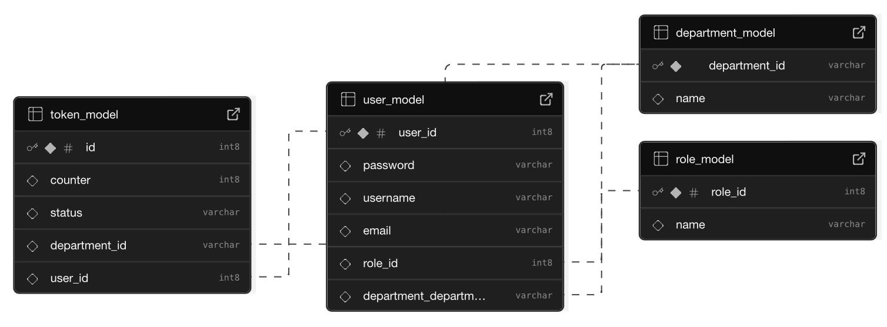

# Token Queue System

> Backend system to manage service queues using tokens.

## Project Structure

```
TOKEN-SYSTEM/
├── consumer-display/           
│   └── frontend/   
│   └── backend/               
├── consumer-notification/     
├── department-system/        
└── token-event-system/        
```

### token-event-system 


- Main backend service to manage tokens and departments.  
- Creates new tokens and adds them to department queues.  
- Publishes token events to a Kafka topic named `token-events`.  
- Runs on port **8080**.

### consumer-notification 


- Kafka consumer for token-related notifications.  
- Sends emails via SMTP after token creation and serving.  
- Runs on port **8081**.

### consumer-display 


- Kafka consumer to fetch real-time token data.  
- Uses Server-Sent Events (SSE) to stream updates to frontend.  
- Frontend displays department-wise tokens.  
- Backend runs on port **8082**.  
- Frontend runs on port **5173**.

### department-system 


- Internal backend for department employees.  
- Shows queue status and allows serving tokens.  
- Sends updates to Kafka after serving tokens.  
- Runs on port **8083**.

## System Design & Workflow

<div align="center">
  
</div>

1. User requests a token from the system.

2. The token is:
   - Added to a Kafka topic `token-events`.
   - Pushed into the Redis queue of the respective department.
   - Assigned a token number using a Redis counter (one per department).
   - Contains the following data:

     ```json
     {
       "eventType": "TOKEN_GENERATED",
       "tokenId": 101,
       "departmentId": "CW",
       "tokenNo": 12,
       "userId": 55,
       "email": "user@example.com",
       "timestamp": "2025-08-07T10:23:45Z"
     }
     ```

3. User receives an email notification confirming token generation.

4. Display system updates in real time as SSE pushes the new queue status to the React frontend.

5. Department employees:
   - View the current token queue.
   - View and serve the next token.
   - Upon serving, the token is removed from the queue and a new event is pushed to Kafka:

     ```json
     {
       "event": "TOKEN_SERVED",
       "tokenId": 101
     }
     ```

6. User receives a second notification once the token is served.

---

## Schema Design

<div align="center">
  
</div>

---

## Next Steps

1. Role-based access for departments and users. Schema already supports roles, but logic is not implemented.  
2. Add proper authentication and authorization flow.  
3. Migrate notification system to a queue-based design. Include a primary queue and a dead-letter queue (DLQ) to support scaling and reliability.

---
